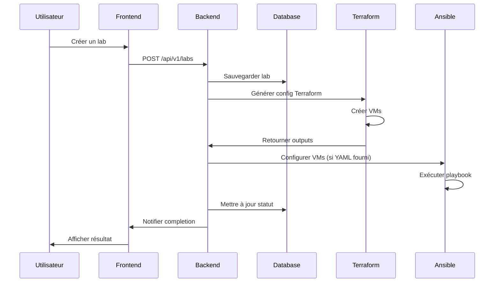
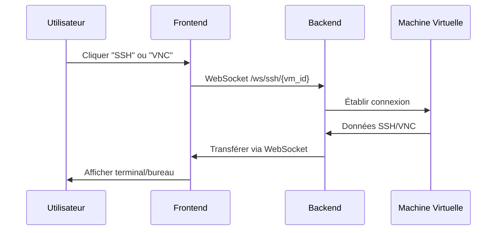

# Architecture Technique - Virtual Lab Manager

## Vue d'ensemble

Virtual Lab Manager est une application web moderne conçue pour la gestion et le déploiement automatisé de laboratoires virtuels. L'architecture suit un modèle client-serveur avec séparation claire des responsabilités.

## Architecture Globale

```
┌─────────────────┐    ┌─────────────────┐    ┌─────────────────┐
│   Frontend      │    │    Backend      │    │  Infrastructure │
│   (React)       │◄──►│   (FastAPI)     │◄──►│   (QEMU/KVM)    │
└─────────────────┘    └─────────────────┘    └─────────────────┘
         │                       │                       │
         │                       │                       │
         ▼                       ▼                       ▼
┌─────────────────┐    ┌─────────────────┐    ┌─────────────────┐
│     Nginx       │    │   PostgreSQL    │    │   Terraform     │
│  (Reverse Proxy)│    │   (Database)    │    │   (IaC)         │
└─────────────────┘    └─────────────────┘    └─────────────────┘
                                │                       │
                                │                       ▼
                                │              ┌─────────────────┐
                                │              │     Ansible     │
                                │              │ (Configuration) │
                                │              └─────────────────┘
                                │
                                ▼
                       ┌─────────────────┐
                       │   WebSockets    │
                       │   (SSH/VNC)     │
                       └─────────────────┘
```

## Composants Principaux

### 1. Frontend (React + Tailwind CSS)

**Technologies :**
- React 19 avec hooks
- Tailwind CSS pour le styling
- shadcn/ui pour les composants
- Vite comme bundler
- xterm.js pour les terminaux SSH
- WebSocket API pour les connexions temps réel

**Structure :**
```
frontend/
├── src/
│   ├── components/          # Composants réutilisables
│   │   ├── ui/             # Composants UI de base
│   │   ├── SSHTerminal.jsx # Terminal SSH intégré
│   │   ├── VNCViewer.jsx   # Viewer VNC
│   │   └── Navbar.jsx      # Navigation
│   ├── pages/              # Pages de l'application
│   │   ├── Dashboard.jsx   # Tableau de bord
│   │   ├── CreateLab.jsx   # Création de labs
│   │   ├── LabDetails.jsx  # Détails d'un lab
│   │   └── VMDetails.jsx   # Détails d'une VM
│   ├── services/           # Services API
│   │   └── api.js          # Client API REST
│   └── hooks/              # Hooks personnalisés
│       └── use-toast.js    # Gestion des notifications
```

**Responsabilités :**
- Interface utilisateur intuitive
- Gestion des états locaux (React hooks)
- Communication avec l'API backend
- Affichage temps réel des logs de déploiement
- Intégration SSH/VNC dans le navigateur

### 2. Backend (FastAPI + SQLAlchemy)

**Technologies :**
- FastAPI pour l'API REST
- SQLAlchemy comme ORM
- PostgreSQL comme base de données
- Pydantic pour la validation des données
- WebSockets pour les connexions temps réel
- Asyncio pour la programmation asynchrone

**Structure :**
```
backend/
├── main.py                 # Point d'entrée FastAPI
├── database.py             # Configuration base de données
├── models.py               # Modèles SQLAlchemy
├── schemas.py              # Schémas Pydantic
├── routers/                # Endpoints API
│   ├── labs.py            # API des laboratoires
│   ├── vms.py             # API des machines virtuelles
│   └── websocket.py       # WebSocket SSH/VNC
└── services/               # Logique métier
    ├── deployment.py       # Orchestration déploiement
    ├── terraform_service.py # Gestion Terraform
    ├── ansible_service.py  # Gestion Ansible
    ├── vm_management.py    # Gestion des VMs
    └── websocket_service.py # Proxy WebSocket
```

**Responsabilités :**
- API REST pour la gestion des labs et VMs
- Orchestration des déploiements Terraform/Ansible
- Gestion des états des VMs
- Proxy WebSocket pour SSH/VNC
- Persistance des données
- Logging et monitoring

### 3. Base de Données (PostgreSQL)

**Schéma Principal :**

```sql
-- Laboratoires
CREATE TABLE labs (
    id UUID PRIMARY KEY,
    name VARCHAR(255) NOT NULL,
    description TEXT,
    status VARCHAR(50) DEFAULT 'pending',
    created_at TIMESTAMP DEFAULT NOW(),
    updated_at TIMESTAMP DEFAULT NOW()
);

-- Machines virtuelles
CREATE TABLE vms (
    id UUID PRIMARY KEY,
    lab_id UUID REFERENCES labs(id) ON DELETE CASCADE,
    name VARCHAR(255) NOT NULL,
    vcpu INTEGER NOT NULL,
    ram_mb INTEGER NOT NULL,
    disk_gb INTEGER NOT NULL,
    os_image VARCHAR(100) NOT NULL,
    status VARCHAR(50) DEFAULT 'pending',
    ssh_port INTEGER,
    vnc_port INTEGER,
    ansible_config_yaml TEXT,
    created_at TIMESTAMP DEFAULT NOW(),
    updated_at TIMESTAMP DEFAULT NOW()
);

-- Logs de déploiement
CREATE TABLE deployment_logs (
    id SERIAL PRIMARY KEY,
    lab_id UUID REFERENCES labs(id) ON DELETE CASCADE,
    log_type VARCHAR(50) NOT NULL,
    content TEXT NOT NULL,
    created_at TIMESTAMP DEFAULT NOW()
);
```

### 4. Infrastructure (QEMU/KVM + libvirt)

**Technologies :**
- QEMU/KVM pour la virtualisation
- libvirt pour la gestion des VMs
- Terraform provider libvirt
- Images cloud-init pour l'initialisation

**Gestion des Ressources :**
- Pool de stockage par défaut : `/var/lib/libvirt/images`
- Réseau NAT par laboratoire
- Ports SSH : 22000-22999
- Ports VNC : 5900-5999

### 5. Automatisation (Terraform + Ansible)

**Terraform :**
- Création de l'infrastructure VM
- Configuration réseau
- Gestion du cycle de vie des ressources
- Outputs pour les informations de connexion

**Ansible :**
- Configuration logicielle des VMs
- Installation de packages
- Configuration des services
- Déploiement d'applications

## Flux de Données

### 1. Création d'un Laboratoire



### 2. Connexion SSH/VNC



## Sécurité

### 1. Authentification et Autorisation
- Sessions utilisateur (à implémenter)
- Validation des entrées avec Pydantic
- Isolation des VMs par laboratoire

### 2. Réseau
- Firewall UFW configuré automatiquement
- Isolation réseau des VMs
- Proxy WebSocket sécurisé

### 3. Système
- Utilisateur système dédié (`vlm`)
- Permissions minimales
- Logs d'audit

## Performance

### 1. Backend
- API asynchrone avec FastAPI
- Pool de connexions PostgreSQL
- Cache en mémoire pour les sessions WebSocket

### 2. Frontend
- Build optimisé avec Vite
- Lazy loading des composants
- Gestion efficace des états React

### 3. Infrastructure
- Images VM pré-construites
- Snapshots pour la sauvegarde rapide
- Allocation dynamique des ressources

## Monitoring et Logs

### 1. Logs Système
- journalctl pour les services systemd
- Logs Nginx pour les requêtes HTTP
- Logs libvirt pour la virtualisation

### 2. Logs Application
- Logs FastAPI avec rotation
- Logs de déploiement Terraform/Ansible
- Métriques de performance

### 3. Monitoring
- Health checks automatiques
- Surveillance des ressources système
- Alertes en cas d'erreur

## Évolutivité

### 1. Horizontale
- Séparation possible backend/frontend
- Support multi-serveurs (à implémenter)
- Load balancing avec Nginx

### 2. Verticale
- Optimisation des requêtes SQL
- Cache Redis (à implémenter)
- Compression des assets

## Maintenance

### 1. Sauvegardes
- Script automatique de sauvegarde
- Sauvegarde base de données + configurations
- Rétention configurable

### 2. Mises à jour
- Script de mise à jour automatique
- Migration de schéma de base de données
- Tests de régression

### 3. Surveillance
- Monitoring des services
- Alertes système
- Tableaux de bord de santé

